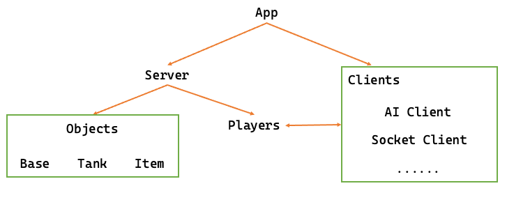
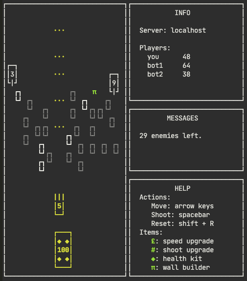

# 坦克大战

2020年春季学期《高级程序设计》第二次课程设计

计算机科学与技术系 171860508 张天昀

---

<p style="text-align:center"></p>

<p style="text-align:center">这个程序看起来很牛逼但是真的没有在内卷</p>

## 一、主要内容

本次试验的主要内容为实现一个终端命令行界面的坦克大战游戏。

整个工程的代码目录结构如下：

```
Tank
├── CMakeLists.txt                         # CMake配置文件
├── README.md                              # 此文档
├── assets                                 # 文档使用的一些素材
├── dist                                   # 预编译的可执行文件
│   ├── README.md                          # 编译步骤说明文档
│   ├── tank-darwin-amd64                  # macOS平台
│   ├── tank-linux-debian-amd64            # Linux 仅限Debian系发行版
│   └── tank-windows-mingw64-static.exe    # Windows 静态编译
└── src
    ├── headers                            # 一大堆头文件
    │   ├── app.h
    │   ├── client.h
    │   ├── clients
    │   │   ├── ai.h
    │   │   └── socket.h
    │   ├── common.h                       # 调试开关+调色板宏
    │   ├── debug.h                        # 祖传调试宏
    │   ├── object.h
    │   ├── objects
    │   │   ├── base.h
    │   │   ├── border.h
    │   │   ├── bullet.h
    │   │   ├── item.h
    │   │   ├── tank.h
    │   │   └── wall.h
    │   ├── packet.h
    │   ├── player.h
    │   └── server.h
    ├── app.cpp                            # 游戏软件类
    ├── client.cpp                         # 抽象客户端类
    ├── clients                            # 各种游戏客户端
    │   ├── ai.cpp                         # AI客户端
    │   └── socket.cpp                     # 套接字客户端
    ├── main.cpp                           # 程序主入口
    ├── object.cpp                         # 抽象物体类
    ├── objects                            # 各种游戏中的物体
    │   ├── base.cpp                       # 基地
    │   ├── border.cpp                     # 边界
    │   ├── bullet.cpp                     # 子弹
    │   ├── item.cpp                       # 道具
    │   ├── tank.cpp                       # 坦克
    │   └── wall.cpp                       # 障碍物
    ├── packet.cpp                         # 数据包类
    ├── player.cpp                         # 玩家类
    └── server.cpp                         # 服务器类
```

## 二、程序设计

### 2.1 类关系图

<p style="text-align:center"></p>

### 2.2 前后端分离

在设计程序的初期，一切都很简单：

- 从`main`函数开始运行，创建一个游戏类`game`；
- 将控制权交给`game`，游戏每隔一定时间更新一次；
- 读取用户输入、运行游戏逻辑、将游戏内容绘制到终端上……

渐渐的这个`game`类开始变得臃肿：

- 游戏开始前要展示画面和选项；
- 读取输入需要对各种情况进行处理；
- 游戏逻辑需要考虑各种物体之间的交互；
- 绘制游戏内容需要调用`curses`库；
- 还有个“AI”没做呢……

游戏的逻辑处理、界面绘制和将来要做的AI玩家如果全部堆在一个`game`类里，就会让整个代码变得庞大且难以维护；所以还是决定将游戏的前后端分离。

考虑到Valve一众游戏（比如说CS）是这样子运行的：

- 游戏开始，有一个开始菜单，可以选择地图、BOT数量等参数；
- 点击开始游戏后，游戏会创建一个本地服务器，加载游戏所需要的资源；
- 服务器启动后，再创建一个客户端，玩家通过客户端进行游戏；
- 玩家退出时，客户端和服务器都被销毁，回到菜单。

我模仿这个例子，将坦克大战实现成下面这个样子：

- 创建一个`App`类，负责处理游戏开始前的菜单，并正确地启动游戏；
- 游戏后端`Server`类只负责加载游戏资源、获取玩家操作、处理各种数据交互；
- 游戏前端`Client`类负责将从后端获取的数据展示给玩家（可能是AI玩家直接访问内存数据，也可能是真人玩家通过画面了解游戏状况）；并将玩家的输入反馈给服务端。

由此一来，实现了整个程序中最臃肿的功能的拆分，并为后续开发做好了准备。

### 2.3 前后端同步

TL;DR：套接字通信+状态同步。

<p style="text-align:center"></p>

对于AI玩家来说，直接将服务端的各种类都声明它的友元即可。AI玩家在服务端运行，通过友元关系直接获取到游戏的各种数据（相当于上帝视角），并根据这些数据（由于能力不够，所以还有一个随机概率）来做出自己的操作。

而对于人类玩家来说，玩家不能开上帝视角（那是作弊），只能根据游戏选择性透露给玩家的信息来做出反应。为此，需要有一种方式来保证玩家操控的前端和游戏的服务端进行同步。

- 内存访问：要求前后端必须运行在同一进程中（或者通过共享内存实现），且可能由于冒险出现导致数据前后不一致，需要严格的同步（比如说玩家发射子弹以为打中了但实际上目标的位置已经改变而画面上没有显示）。
- 文件访问：需要一套合理的文件格式，且仅限于本地（或者得挂载其他地址），并不划算。
- 网络访问：
  - 需要一套合理的应用层协议，实现难度较大；
  - 如果用TCP可以保证数据包的顺序；
  - 支持各种多人玩法，可扩展性强……

<p style="text-align:center"></p>

<p style="text-align:center">最后脑子一热就选了网络编程（当事人很后悔，就是后悔）。</p>

下图是最新的2020爆款坦克大战数据协议：

<p style="text-align:center"></p>

数据采用最简单的定长字段，使用TCP协议传送，避免了给数据包排序、处理丢包和“粘包”的问题。

上行数据包很简单，就是客户端告诉服务端在当前帧玩家做了什么操作。

而下行数据包就分为几种：

- `PACKET_OBJECT`：告知客户端有这么一种物体在地图的某处，长什么样子。
- `PACKET_PLAYER`：告知客户端有这么一个玩家，他的得分是多少。
- `PACKET_MESSAGE`：告知客户端有一个字符串的消息。
- `PACKET_NULL`：一个空的包，一定是当前帧的最后一个包。

客户端通过解析服务器发来的包，就可以将整个游戏画面展现给玩家了。为了让客户端知道更多信息，使得绘制出来的画面更加精美，服务端还通过标志位记载了一些有用的信息：

- `FLAG_IS_CURRENT_PLAYER`：这个包对应的数据是这个客户端玩家的。
- `FLAG_IS_ANOTHER_PLAYER`：这个包对应的数据是另外一个人类玩家的。
- `FLAG_IS_ITEM`：这个包对应的数据是个道具物体。
- `FLAG_IS_NORMAL_TANK`：这个包对应的数据是个普通坦克。
- `FLAG_IS_SPEED_TANK`：这个包对应的数据是个速度升级了的坦克。
- `FLAG_IS_HEAVY_TANK`：这个包对应的数据是个HP和攻击力升级了的坦克。
- `FLAG_IS_BRICK_WALL`：这个包对应的数据是个豆腐渣墙壁。
- `FLAG_IS_METAL_WALL`：这个包对应的数据是个钛合金墙壁。
- `FLAG_END_OF_FRAME`：这个包是这一帧的最后一个数据包了。
- `FLAG_END_OF_GAME`：收到这个包表示游戏结束。

于是，整个游戏的生命周期就变成：

- 创建服务端，服务端监听端口等待玩家加入；
- 客户端连接服务端，建立TCP通信；
- 服务端疯狂地向客户端发包，客户端绘制游戏；
- 客户端疯狂地向服务端报告玩家的操作；
- 游戏结束，客户端和服务端分手并各自善后。

### 2.4 服务器类

`Server`类有一些重要的成员变量和函数，我们先来看看成员变量：

- `Player *world`：一个“并不存在”的玩家，就像CS中如果摔死了游戏的log会显示“世界”给玩家造成xx点伤害，这里的`world`就是一个假的玩家，用来生成游戏地图中的物体。
- `vector<Player *> players`：真实的玩家列表，服务端每个tick都会和这些玩家进行通信。
- `vector<Object *> objects`：游戏在当前帧中存在的物体列表。
- `vector<Object *> appends`：在下一帧中将会被加入游戏的物体列表。
- `vector<Object *> brokens`：在下一帧中将会被移除游戏的物体列表。

这里将物体列表分为3个不同的容器，是为了解决循环时修改范围的问题：每个物体在进行逻辑执行后都可能会影响别的物体或者添加新的物体到游戏中（比如坦克开炮），此时如果直接修改或者添加到`objects`中，就可能导致循环体执行出错。所以将物体容器分为三个，避免在循环中修改循环范围。

服务端的生命流程如下所示：

```
init() ---> logic() ---> post() -+-> over()
        ^                        |
        | repeatedly call tick() |
        +------------------------+
```

在`init()`阶段，服务端会根据参数初始化游戏的玩家和物体列表，并等待玩家进行连接。

当所有玩家成功连接后，就进入`tick()`的循环。这里的循环采用了《计算机系统基础》课程中学到的经典写法：

```C++
// 如果在tick()函数中修改了status变量，则代表游戏结束了
while (status == SERVER_PLAY) {
  while (now < next) {              // 下一帧还没到来，自旋等待
    now = duration_cast<milliseconds>(system_clock::now().time_since_epoch());
  }                                 // 下一帧的时机到来了
  next = now + (1000 / fps) * 1ms;  // 计算再下一帧的时机
  ++frame, tick();                  // 处理当前帧的逻辑
}
```

每一次`tick()`都分为两个部分：

- `logic()`：运行游戏逻辑，所有物体先自己运动，然后处理与其他物体的交互，具体见第2.5节；
- `post()`：将游戏逻辑运行完成之后新的游戏状态通报给所有玩家，即状态同步方式，具体见2.6节。

如果某一次`logic()`函数中发现满足游戏结束条件，则会结束循环进入`over()`，结束连接并销毁资源。

### 2.5 物体类

服务端的核心就是一些物体和他们之间进行交互。为了实现不同种类的物体，`Object`类被定义成一个抽象类。

不同的物体之间具有如下的共通属性：

- 指向服务端和玩家的指针；
- 物体类型、坐标、大小、在终端中显示的样式、速度；
- 物体生命值、是否可被破坏、是否可以重叠放置。

`Object`类具有以下两个重载运算符的纯虚函数：

```C++
virtual void operator()() = 0;
virtual void operator()(Object *object) = 0;
```

其中，`operator()()`表示物体本身的执行逻辑，包括：

- 障碍物静止不动；
- 坦克发射的炮弹匀速向前飞；
- 从玩家那里获取输入并让坦克运动（见2.6节）等。

而另一个重载的函数运算符`operator()(Object *object)`则表示物体之间的互动逻辑，包括：

- 坦克发射的炮弹击中目标；
- 在地上的道具和坦克发生碰撞（即玩家捡到道具）等。

这两个函数都会对服务端产生不同的影响，可能通过`object`指针直接操纵另一个对象；也可能通过`server`指针调用服务端的处理函数。

除了纯虚函数以外，还有以下函数的用处也很大：

```C++
void move();            // 按照当前的速度移动
void damage();          // 给当前物体造成1点伤害
void suicide();         // 物体执行自毁（如炮弹命中即自毁）
virtual void update();  // 更新物体样式（如坦克朝向不同）
```

在以上抽象物体类的基础上，我们可以轻易的定制出不同的物体。比如说坦克：坦克是一个3*3的矩形，每次执行逻辑都会从玩家的客户端那里获取动作然后进行运动或射击；而坦克不会主动和其他的物体交互；坦克每个tick都会根据自己的朝向和额外能力更新终端中显示的样式。

在这个模块中还有一些辅助性的友元函数，用于服务端处理逻辑和AI智障决策：

```C++
friend int distance(const Object *obj1, const Object *obj2);   // 获取曼哈顿距离
friend bool collide(const Object *obj1, const Object *obj2);   // 判断是否碰撞
friend bool in_sight(const Tank *tank, const Object *object);  // 判断是否在视野内
```

### 2.6 玩家类

玩家类实际上是一个服务端和客户端的中间层。它的实现相对较为简单，一个玩家有如下的属性：

- 指向服务器、客户端的指针；
- 玩家类型（`world`、AI或人类）；
- 分数、纵坐标、复活计数器；
- 指向坦克和基地的指针。

玩家类实现了三个重要的成员函数：

- `enum PlayerAction act()`：从玩家对应的客户端获取输入（具体见2.7节）；
- `void respawn()`：等待一段时间后，在一个范围内的随机位置复活玩家的坦克；
- `void genBase()`：生成玩家对应的基地。

玩家可能需要坦克，也可能不需要（如`world`这个假玩家）；玩家可能需要基地（人类玩家），也可能不需要（AI玩家），所以后两个函数都会根据不同的玩家类型进行判断。

### 2.7 客户端类

客户端类是整个程序中唯一能与服务端类相提并论的类了。

客户端类是一个抽象类，具有和玩家、服务端进行通信的接口：

```C++
virtual enum PlayerAction act() = 0;
virtual bool post(unsigned now, unsigned flags) = 0;
virtual bool post(unsigned now, unsigned flags, const Object *object) = 0;
virtual bool post(unsigned now, unsigned flags, const Player *player) = 0;
virtual bool post(unsigned now, unsigned flags, const char *message) = 0;
```

其中`act()`函数是将客户端的输入上行发送给服务端，消息传输的路径为：

```C++
Client::act() ---> Player::act() ---> Object::act() ---> Server::logic()
```

而另外的几个重载函数`post()`则是将服务端的信息下行发送给客户端，消息传输的路径为：

```C++
Server::post() ---> Player::post() ---> Client::post()
```

在实现具体的客户端时，两种函数的实现方式不同：

- AI客户端：`act()`中直接通过友元开挂，获取所有数据并决策；`post()`无需发送信息。
- 套接字客户端：`act()`中读取服务端收到的来自客户端的信息，`post()`中服务端给客户端发送信息。除此以外，套接字客户端还具有**双重身份**~~（一类两用，超级耦合）~~，可以独立运行（见2.9节）来给玩家显示画面。

由此一来，服务端和客户端的交互就打通了。

### 2.8 AI客户端：人工智障的外挂人生

用C++写的人工智障是如何“算计”玩家的呢？

- 友元外挂：通过友元关系肆意获取人类玩家不可见的数据；
- 数值堆砌：人类是有极限的，而程序决策的频率比人高多了；
- 随机概率：通过随机数乱搞让人工智障获得惊人的智慧。

我给人工智障设计了三个决策参数：

- `double coef_thinking`：每次决策后会休息多少帧
- `double coef_shooting`：如果有目标在视野内，以多大的概率开炮
- `double coef_random`：以多大的概率随机执行决策

如果既没有随机决策，也没有开炮，那么AI就会先按照Y方向移动到目标基地所在的位置，然后调整X坐标并开炮射击目标。再通过适当提高AI决策的随机性，一个堆参数堆出来的人工智障就做好了。

### 2.9 套接字客户端：收发包+绘制游戏界面

图形界面采用ncurses库，由于程序的规模不是很大所以就在客户端类中实现了游戏界面的绘制。

如上文所说，套接字客户端是一个具有**双重身份**的类（但实际上这个做法不好，因为太耦合了，如果后续继续开发更复杂的内容我肯定会拆开来）。

```C++
                       TCP Packets
ncurses <----> client <-----|-----> client <----> player <----> server
           (on client side) |   (on server side)
```

- 客户端需要在玩家一侧独立运行，给玩家显示画面，从外部读入输入并发给服务端；
- 客户端类的对象也可以是服务端玩家类的一个数据成员，通过对应的接口获取玩家获得的输入。

因为具有双重身份，所以当你打开`src/clients/socket.cpp`你会发现里面代码就像*山一样一团乱……（自闭了）

和服务端类似，独立运行的套接字客户端也有一套生命周期：

```
init() ---> tick() -+-> over()
        ^           |
        +-----------+
```

在`init()`中，套接字客户端通过指定的地址与服务器建立连接，并创立游戏界面的各个窗口。然后不断循环`tick()`：每次先把玩家输入发送出去，然后从套接字获取服务端发来的数据并进行处理，直到游戏结束。最后进入`over()`显示“Game Over”，然后销毁资源。

得益于服务端和客户端的拆分，套接字客户端只需要把收到的数据包绘制出来就可以了。图形界面的绘制使用了ncurses库。在客户端收到包之后，会把数据流转换成一个`ServerPacket`对象，然后根据对象的类型进行不同的操作：

- `PACKET_OBJECT`：在游戏地图区域中绘制一个物体；
- `PACKET_PLAYER`：在游戏信息区域中打印玩家信息；
- `PACKET_MESSAGE`：在游戏消息区域打印一条消息。

其实这个绘制界面没什么好讲的……有一个有趣的地方可以看4.1节（鬼才代码）。

### 2.10 未完待续？

通过将游戏逻辑和画面展示拆开，通过套接字通信，此套方案后续可持续发展能力不可谓不强：

- 将服务端和客户端彻底分离（解开2.7节中的耦合），把客户端打造成3D大战；
- 将套接字客户端收到的数据和玩家的输入导出并用来训练模型，可以直接用python写一个真正的人工智能玩家，脱离C++语言和本工程的限制。

以上内容均为画饼，均不会在提交的作业（正片）中出现，估计属于有生之年系列。

## 三、程序运行

程序提供了三种预编译好的二进制文件，三种文件分别对应Windows10、Debian系GNU/Linux、macOS平台。如果需要手动编译可以阅读`dist/README.md`，里面提供了详细的编译步骤。

由于服务端启动后监听`0.0.0.0:23333`地址，因此在Windows或macOS平台下第一次运行会触发防火墙，提示需要连接网络权限。程序内没有病毒，可以放心使用。

<p style="text-align:center"></p>

请记得运行前先把命令行窗口开大一点，在Windows Terminal中的运行效果如下图：

<p style="text-align:center"></p>

以下截图均为Debian10平台下VSCode中的终端的运行截图。

### 3.1 模式选择

运行程序后，首先可以看到标题界面：

<p style="text-align:center"></p>

可以用方向键选择模式，并按下回车选择。前两项为单人模式（消灭30个坦克胜利和无尽模式），后两项为多人合作/对抗模式。菜单的第五项为连接到远程服务器，需要输入服务器地址：

<p style="text-align:center"></p>

### 3.2 单人模式

游戏启动后，主界面如下图所示：

<p style="text-align:center"></p>

可以看到，界面分为四大块：

- 左侧显示游戏界面；
- 右侧分别是服务器信息、消息和游戏帮助。

在游戏界面中，玩家可以使用方向键移动坦克、空格键开炮、`shift+R`重置坦克。

坦克共有三种，不同种类坦克之间除了初始HP显示不同外，没有样式差别。三种坦克分别为：

- 普通坦克：5HP，移动速度和炮弹速度中等；
- 轻便坦克：3HP，移动速度快，炮弹射速高；
- 重型坦克：9HP，移动速度比乌龟还慢，但一次可以射出两发炮弹。

障碍物共有两种，高亮颜色不同，分别为：

- 豆腐渣墙：5HP，昏暗表示；
- 钛合金墙：10HP，高亮表示。

所操控玩家的坦克、基地和其他物品用黄色高亮显示。玩家的基地共有100HP。每次玩家复活都有3秒的惩罚时间（自己重置也会有惩罚），会随机生成三种坦克中的一种。当玩家的基地被打爆或者完成了通关条件即游戏结束。

<p style="text-align:center"></p>

地图上每个一定时间会随机生成一种道具，道具使用绿色高亮表示。玩家捡到即可获得不同种类的能力：

- 速度升级：坦克的移动速度变成最快的；
- 射击升级：坦克装载霰弹枪，一次发射3发子弹（重型坦克一次发射6发，爽死了）；
- 回复HP：玩家回复坦克最多3HP，回复基地最多15HP（上限999）；
- 制造障碍物：在地图中随机生成最多5堵障碍物，阻碍敌方进攻。

<p style="text-align:center"></p>

然而道具是有时间限制的，超过一定时间就会消失，在消失前会闪烁来提醒玩家。

### 3.3 多人模式

如果选择启动多人模式，那么游戏将会等待另外一个玩家联入后才会开始：

<p style="text-align:center"></p>

此时可以在另一个进程中选择Connect并输入地址来连接游戏。

在合作模式中，两名玩家需要共同保护基地（或者当内鬼）；在对抗模式中，两名玩家需要摧毁对方的基地。

多人模式的界面如下图所示，本机玩家使用黄色高亮表示，而另一名真人玩家使用蓝色高亮表示。

<p style="text-align:center"></p>

## 四、课程设计总结

### 4.1 遇到的问题和解决方案

字符支持问题：ncurses不支持utf-8字符输出。

解决方案：

- 使用ncursesw库、使用`wchar_t`字符类型、`cchar_t`输出类型。这种解决方案太复杂，特别是ncursesw的输出必须使用complex char类型数据，烦得不得了。
- 因为转换类型过于麻烦，所以决定采用ncurses自带的一些有限的绘制符号，使用`NCURSES_ACS`将字符转化为对应的图案并输出。

你甚至可以看到无法阅读的硬编码logo！（草）

<p style="text-align:center"></p>

---

游戏运行效率过低：一番调查发现有两个大问题：

- 随机生成物品时尝试次数过多，解决方案是限制随机次数，如果一直都失败就放弃。
- RTTI和`dynamic_cast`效率太低。查找相关资料后发现C++的RTTI为了进行安全的上下行转换，会对虚函数表、虚基类表的所有内容进行比较，导致运行效率低下。而用C++做游戏基本都会有自己的高效RTTI实现。由于懒得找库，所以使用`static_cast`暴力地解决上下行转换问题。

---

Windows编译问题：mingw64一编译就一堆错误，msvc只能用PDCurses，但没有对应的`form`和`menu`库。

解决方案：mingw64中curses库的引入目录和链接库有问题，必须手动配置（参考`dist/README.md`）。以后不优先考虑用curses了，跨平台支持很不好（Qt大法好）。

---

macOS上标题出错：我也不知道问题在哪，在VSCode的终端中运行完美，所以应该是macOS终端的问题，打印超过连续6个该字符就花了。

<p style="text-align:center"></p>

### 4.2 实验感想

通过本次课程设计，训练了使用继承、聚合来实现面向对象程序设计的能力，进一步掌握了通过继承、重写等方式实现多态的方法。

遗憾的是：

- 本次课程设计除了STL容器以外没有用到范型编程（感觉没地方适合用）。
- 代码风格太烂了（注释代码比低于0.1%，导致后来越写越难维护）。

就课程设计主题而言，学习了如何使用OOP进行游戏设计：

- 通过将基类定义为抽象类，通过RTTI实现类型的上下行转换，以此实现丰富的游戏内容；
- 实现了客户端和服务端的分离（如果是团队作业就好了，感觉真的很有搞头（可这不是软件工程课））；
- 复习了《计算机系统基础》中学习的游戏帧率的实现方式，使用`std::chrono`库进行实现；
- 学习了C++多线程编程（利用`std::thread`），复习了《操作系统》课程知识，同时学习了一下C++互斥锁、RAII/RRID（`std::lock_guard`）相关知识，但没用到；
- 学习了C++网络编程（利用boost/asio库而不是C的标准库），复习了《数据通信》课程内容，受益匪浅。
